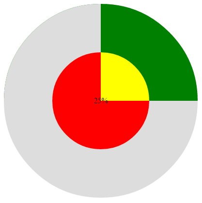
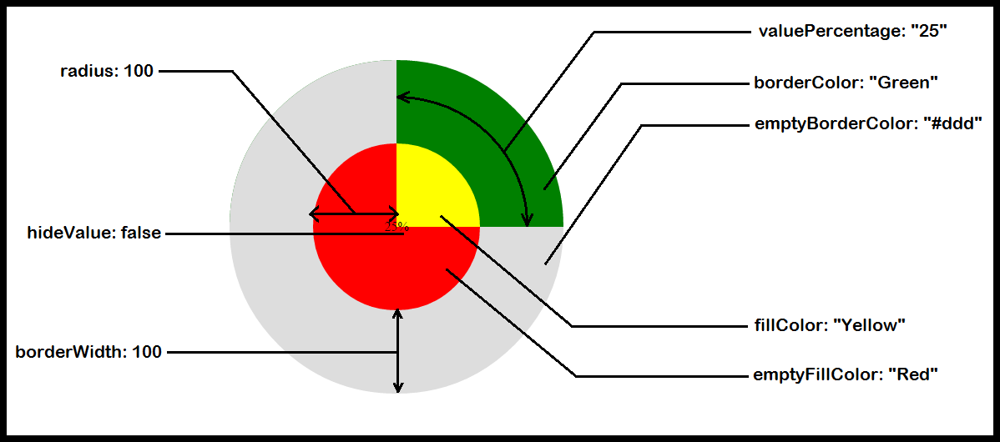

Pie-Chart-and-Circular-Progress-Bar
===================================
Two lightweight JQuery plugins.
The first is a pie chart that can display statistics for several items in a pie chart view.
And the other is a circular progress bar that shows the progress in percentage for a certain item in a circular bar view instead of the normal horizontal bar.

<h2>Circular Progress Bar</h2>
Create Empty div and give it an id: 
&lt;div id="pie1"&gt;&lt;/div&gt;
  
Then call the plugin like this example: 
&lt;script&gt; 
&nbsp;&nbsp;&nbsp;&nbsp;$("#pie1").pie({ 
&nbsp;&nbsp;&nbsp;&nbsp;&nbsp;&nbsp;&nbsp;&nbsp;&nbsp;valuePercentage: "25", 
&nbsp;&nbsp;&nbsp;&nbsp;&nbsp;&nbsp;&nbsp;&nbsp;&nbsp;radius: 100, 
&nbsp;&nbsp;&nbsp;&nbsp;&nbsp;&nbsp;&nbsp;&nbsp;&nbsp;borderWidth: 100, 
&nbsp;&nbsp;&nbsp;&nbsp;&nbsp;&nbsp;&nbsp;&nbsp;&nbsp;fillColor: "Yellow", 
&nbsp;&nbsp;&nbsp;&nbsp;&nbsp;&nbsp;&nbsp;&nbsp;&nbsp;borderColor: "Green", 
&nbsp;&nbsp;&nbsp;&nbsp;&nbsp;&nbsp;&nbsp;&nbsp;&nbsp;emptyFillColor: "Red", 
&nbsp;&nbsp;&nbsp;&nbsp;&nbsp;&nbsp;&nbsp;&nbsp;&nbsp;emptyBorderColor: "#ddd", 
&nbsp;&nbsp;&nbsp;&nbsp;&nbsp;&nbsp;&nbsp;&nbsp;&nbsp;hideValue: false 
&nbsp;&nbsp;&nbsp;&nbsp;}); 
    &lt;/script&gt;
  
The result should look like this image: 

  
The following image explains the settings properties of the plugin: 

